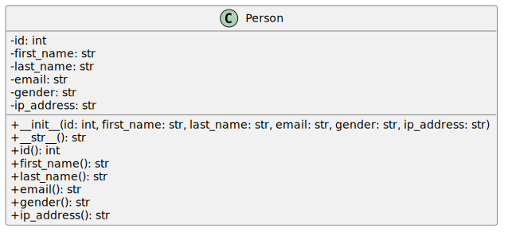

# 13 Daten sortieren

In der folgenden Aufgabe sollen Sie selbstständig zwei Sortieralgorithmen umsetzen, nämlich Selection Sort und Bubble Sort. 

Wichtig: Implementieren Sie die Algorithmen selbstständig. Für das Verständnis hilft die Visualisierung unter folgendem Link: [https://visualgo.net/en/sorting](https://visualgo.net/en/sorting).

## Klasse Person

Gegeben sind Daten in Form der CSV-Datei `data.csv`:

```text
id,first_name,last_name,email,gender,ip_address
1,Lydie,Everit,leverit0@auda.org.au,Female,33.104.148.100
2,Arte,Otley,aotley1@ihg.com,Male,137.94.36.194
3,Iago,Norvel,inorvel2@tumblr.com,Male,138.36.31.199
4,Karel,Braidman,kbraidman3@chron.com,Male,214.21.183.203
```

Schreiben Sie eine Klasse Person nach folgendem Klassendiagramm:



Nutzen Sie für die Implementierung der Getter-Funktionen die kennengelernten Funktionsdekoratoren.

## Daten importieren

Schreiben Sie nun eine Funktion `load_person_data_from_file()`, welcher als Übergabeparameter der Dateiname übergeben wird. 
Die Funktion soll die Daten aus der CSV-Datei laden und einen Liste von Objekten des Typs `Person` zurückliefern.

## Selection Sort

Schreiben Sie nun eine Funktion `selection_sort_by_first_name()`,

* welcher die Liste an Personen übergeben wird.
* Die Funktion soll einen selbstgeschriebenen Selection Sort Algorithmus nutzen, um die Liste nach dem Vornamen zu sortieren.
* Am Ende Soll die Funktion die sortierte Liste zurückliefern.

## `getattr` 

Die Funktion `selection_sort_by_first_name()` sortiert immer nach dem Vornamen. 
Folgender Code zeigt, wie man ein Attribut einer Klasse mit Hilfe eines Strings erhält:

```python
person = Person("1", "Lydie", "Everit", "leverit0@auda.org.au", "Female", "33.104.148.100")
ip_address = getattr(person, "ip_address")
```

Nutzen Sie die Funktion `getattr`, um die Funktion `selection_sort_by_first_name()` zu einer allgemeinen `selection_sort_by()` umzuschreiben, welcher die Liste an Daten, als auch der String des Sortierschlüssels übergeben wird, nachdem sortiert werden soll.

## Bubble Sort

Schreiben Sie nun noch eine Funktion `bubble_sort_by()`,

* welcher die Liste an Personen und der Sortierschlüssel als String übergeben wird.
* Die Funktion soll einen selbstgeschriebenen Bubble Sort Algorithmus nutzen, um die Liste nach dem Vornamen zu sortieren.
* Am Ende Soll die Funktion die sortierte Liste zurückliefern.

Testen Sie den Code.

## Performance Messungen

Nun wollen wir noch die Ausführungsgeschwindigkeit der zwei Algorithmen testen. 
Folgendes Code-Beispiel zeigt, wie in Python Zeit gemessen werden kann:

```python
import time

start_time = time.time()
bubble_sort_by(persons, "first_name")
end_time = time.time()
delta_t = end_time - start_time
print(f"Ausführungzeit: {delta_t}")
```

Nachdem die Anzahl an zu sortierenden Daten gering ist und Ihr PC nicht immer gleich lang benötigt, sollte man so ein Experiment nicht nur einmal sondern n-Mal durchführen.

Schreiben Sie Code, welcher

1. Die Daten importiert.
2. Die Daten shuffelt (siehe Vorlesungsfolien)
3. Die Daten mit Bubble-Sort sortiert und die Zeit misst.
4. Schritt 2 und 3 100-Mal wiederholt und die durchschnittliche Ausführungszeit (ohne Shuffeln) bestimmt.

Welcher Ihrer beiden Algorithmen ist schneller, Bubble oder Selection Sort?

## Integrierte Sortierfunktion

Messen Sie nun noch, wie lange die in Python integrierte Sortier-Funktion durchschnittlich benötigt.
Schreiben Sie hierfür eine Funktion `integrated_sort_by()`, welche nach dem gleichen Schema aufgerufen wird und dann die Sortier-Funktion von Python aufruft.

Hinweis: Sie können eine Liste an zu messenden Funktionen erstellen und so Code-Duplikation verringern. 

Folgendes Beispiel zeigt, wie das geht:

```python

def function1(param):
    print(f"Funktion 1: {param}")

def function2(param):
    print(f"Funktion 2: {param}")

def function3(param):
    print(f"Funktion 3: {param}")

list_of_functions = [function1, function2, function3]

for func in list_of_functions:
    func("Test")
```

Welche der drei Funktionen würden Sie in Zukunft verwenden?
